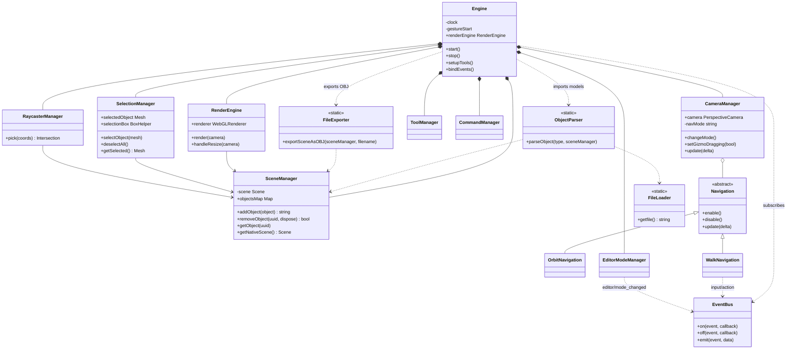
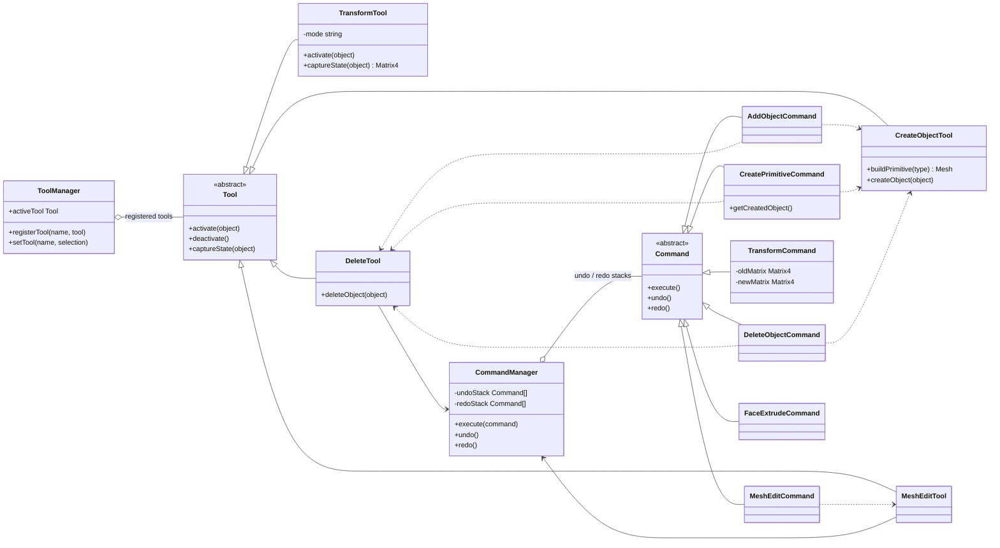
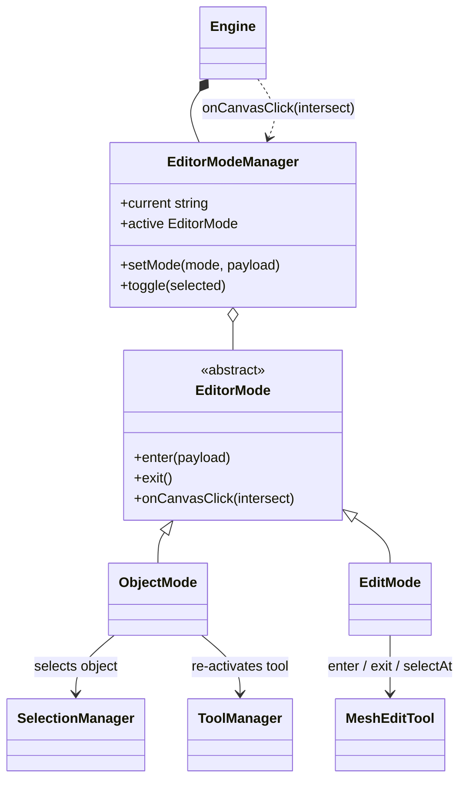
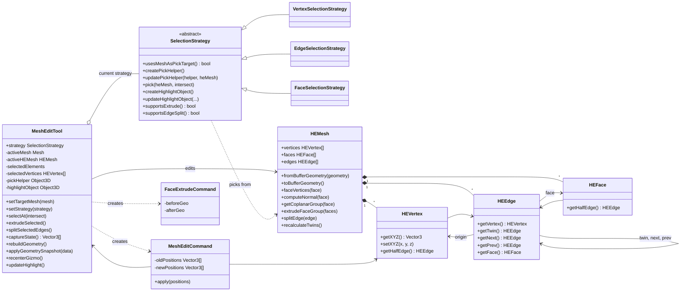
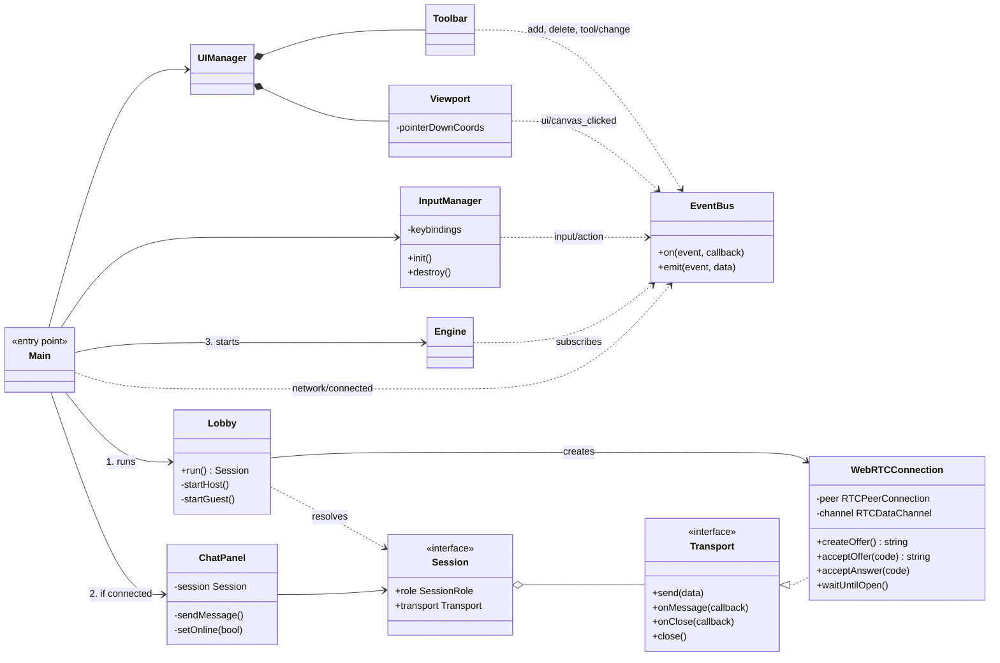

# BlenderPDS - Architecture (UML class diagrams)

Five views of the current code. Modules talk to each other in two ways: direct calls (solid/dashed arrows) and the global `EventBus` (`GLOBAL_BUS`), which decouples the UI, input and engine.

## 1. Engine and managers

`Engine` owns and wires everything. `SceneManager` is the single holder of scene objects, and the other managers read from it.

## 2. Tools and commands

A tool does the work, and a command makes it undoable. `ToolManager` holds the tools, and `CommandManager` holds the undo/redo stacks. Create and delete commands call the create/delete tools so that undo can reverse them. `CreateObjectTool` and `DeleteTool` also write to `SceneManager`, and `DeleteTool` uses `SelectionManager`.

## 3. Editor modes

`EditorModeManager` switches between object mode (select whole objects and use the transform gizmo) and edit mode (edit vertices, edges and faces). The active mode receives every canvas click that `Engine` picks.

## 4. Mesh editing domain

Edit mode works on a half-edge mesh stored in `mesh.userData.heMesh`. A selection strategy decides what a click picks (vertex, edge or face) and what the helper objects look like.

## 5. UI, input and networking

`Main.ts` runs the lobby first. When a session exists it creates the chat panel, then starts the engine. The UI talks to the engine only through `EventBus`.

