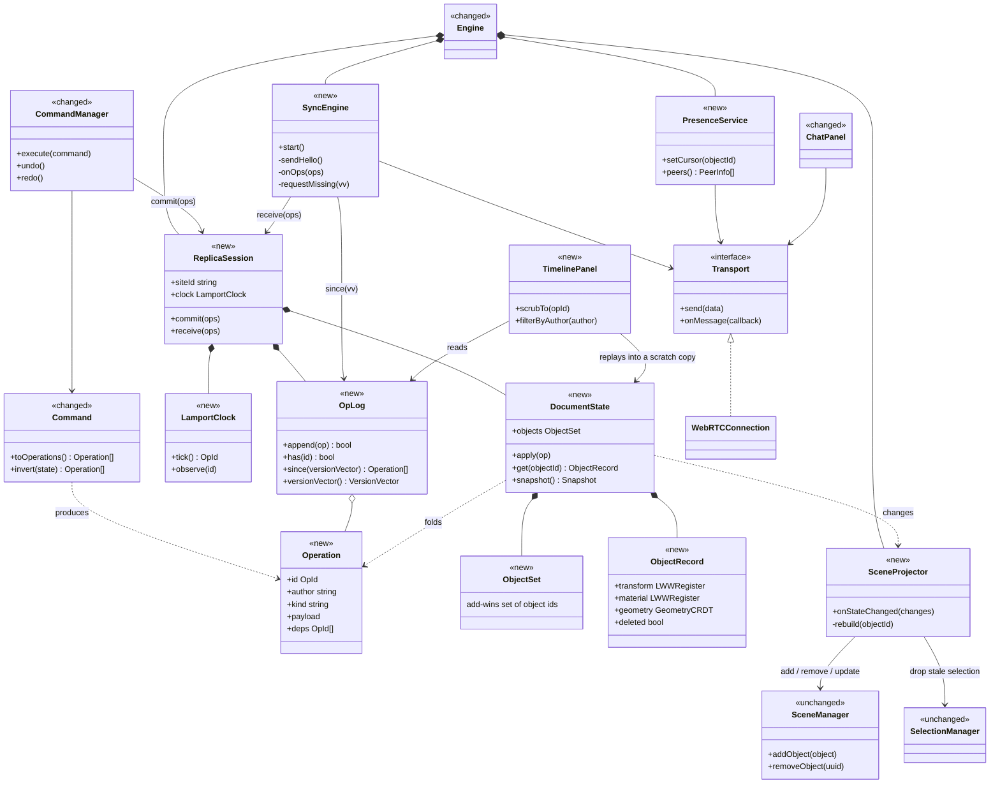
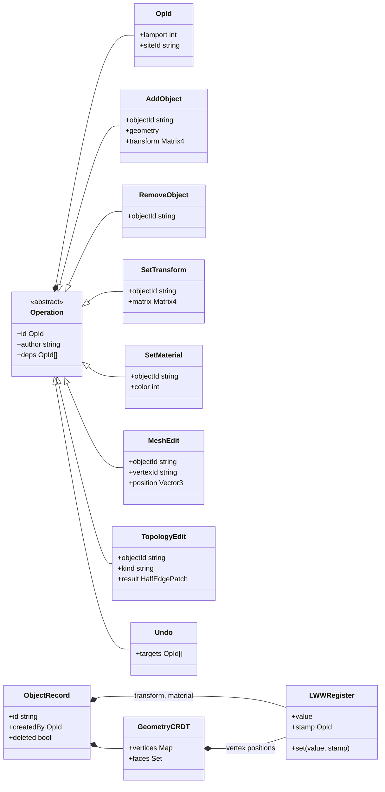
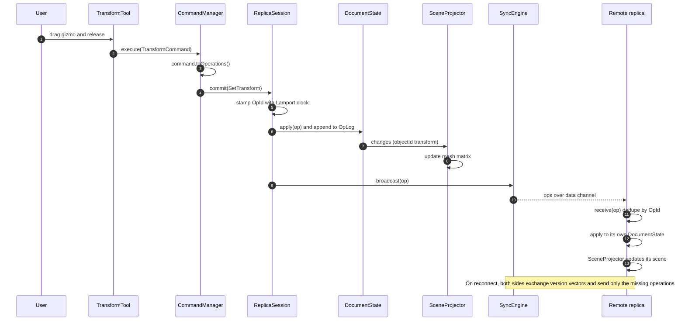

# BlenderPDS - Proposed CRDT architecture

This is a proposal, not the current code. It replaces "commands mutate the scene directly" with "edits are operations in a replicated log, and the scene is a projection of that log". Compare with `architecture.md` for the current state.

The core idea:

- **Operation log** is the source of truth. Every edit is an immutable `Operation` with a unique id, appended to the log.
- **DocumentState** is a CRDT built by folding the log. Two replicas that hold the same set of operations hold the same state, regardless of arrival order.
- **Scene** (three.js) is only a view. `SceneProjector` turns state changes into `SceneManager` calls.
- **Transport** (WebRTC data channel, already built) only moves operations between replicas. No host is needed for correctness, so the lobby's host/guest roles only matter for connection setup.

## 1. Modules and responsibilities

New modules are marked `<<new>>`, modules that change are `<<changed>>`, and everything else stays as it is today.

## 2. Operations and state model

Operations carry results, not recipes. A move is "set transform to this matrix", not "translate by 1". That makes each operation idempotent and lets a last-writer-wins register resolve conflicts. The winner is the higher `(lamport, siteId)` pair, so every replica picks the same one.

Conflict rules:

| Situation | Resolution |
|---|---|
| Both users move the same object | Last writer wins on `transform`. The other move is kept in the log, so it still shows in the timeline. |
| One deletes while the other moves | Delete wins, but the record is only tombstoned. An `Undo` of the delete brings it back. |
| Both add objects | No conflict. Ids are `(siteId, counter)`, so they never collide. |
| Both drag different vertices of one mesh | Both apply. Vertex positions are separate registers. |
| Both extrude or split on the same mesh | The hard case. Topology edits must be expressed as patches on stable vertex and face ids, not array indexes. See the risks below. |

## 3. Flow of one edit

Local edit first (the user drags a gizmo), then what the other replica does with it. The local replica never waits for the network.

## 4. What changes in the existing code

| Today | After | Notes |
|---|---|---|
| `Command.execute()` mutates the scene | `Command.toOperations()` returns operations, and `SceneProjector` mutates the scene | Tools keep their logic. Only the last step changes. |
| `CommandManager` has undo and redo stacks of commands | Per-user stack of `OpId`s. Undo emits an inverse operation (or an `Undo` marker) | Undo must never rewind other people's edits. |
| `SceneManager` is the source of truth | `DocumentState` is the source of truth, and `SceneManager` is a view | Nothing outside `SceneProjector` should call `SceneManager.addObject` for shared content. |
| `Transport` carries chat only | `Transport` carries `hello`, `ops`, `presence` and `chat` messages | Add a `type` switch, which `ChatPanel` already does. |
| Host and guest roles | Symmetric peers after the handshake | Host only matters for the offer/answer exchange. |
| HEMesh vertex and face arrays with index-based ids | Stable ids on `HEVertex` and `HEFace` | Required for merging mesh edits. Do this first. |

## 5. Suggested build order

1. **Stable ids.** Give every object, vertex and face a stable id. No behaviour change.
2. **Operation layer.** Add `Operation`, `OpLog`, `DocumentState` and `SceneProjector` running locally. Convert `AddObject`, `RemoveObject` and `SetTransform` first and keep the app single-player.
3. **Replay and timeline.** Because the log exists, the `TimelinePanel` scrubber is almost free.
4. **Sync.** Add `SyncEngine` over the existing `Transport`: hello with version vector, send missing operations, then live broadcast.
5. **Mesh edits.** Move `MeshEdit` and then `TopologyEdit` onto operations.
6. **Per-user undo and presence.** Last, because they depend on everything above.

## Risks to decide early

- **Library or hand-rolled.** Automerge or Yjs give you the sync protocol and compaction, but topology edits still need a custom model. A hand-rolled log and LWW registers are small for this scope and easy to explain in a course report.
- **Topology merges.** Two concurrent extrudes on one face can produce an invalid half-edge mesh. The simplest safe rule is to lock a mesh to one author while it is in edit mode, and use operations for everything else.
- **Log growth.** Every drag can produce many operations. Emit one `SetTransform` on release, not on every frame. Add snapshots later to compact the log.
- **Security.** A peer can send arbitrary operations. Validate the shape and size of every incoming payload before applying it, as `ChatPanel` does for chat.
